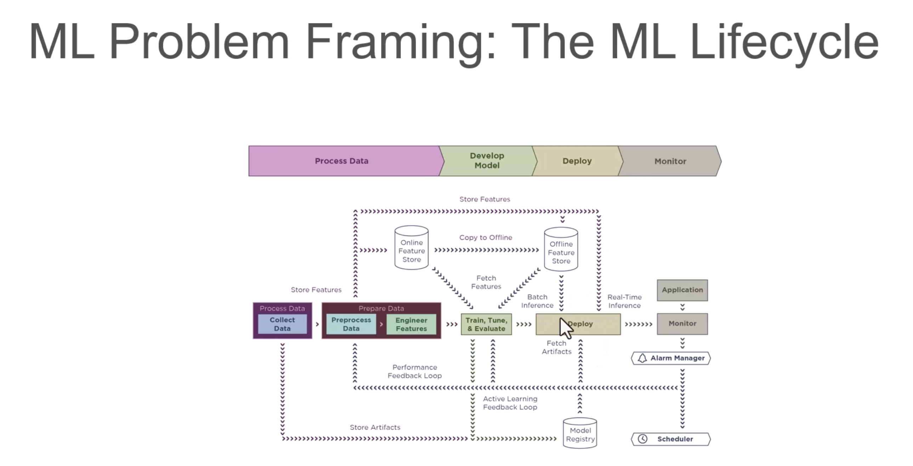

# AWS 

 How many Subnets can you have per VPC?.</code>
 <b>

`200 Subnets per VPC`
</b>

 Relation between the Availability Zone and Region?.</code>
 <b>

Each Region is a separate geographic area. 

Availability Zones are multiple, isolated locations within each Region. 
</b>

 What does AMI include?.</code>
 <b>

An AMI includes the following things:

* A template for the root volume for the instance.

* Launch permissions to decide which AWS accounts can avail the AMI to launch instances.

* A block device mapping that determines the volumes to attach to the instance when it is launched.
</b>

 What does serverless mean to you ?.</code>
 <b>

Serverless is a cloud-native development model that allows developers to build and run applications without having to manage servers.

There are still servers in serverless, but they are abstracted away from app development. A cloud provider handles the routine work of provisioning, maintaining, and scaling the server infrastructure. Developers can simply package their code in containers for deployment.

Once deployed, serverless apps respond to demand and automatically scale up and down as needed. Serverless offerings from public cloud providers are usually metered on-demand through an event-driven execution model. As a result, when a serverless function is sitting idle, it doesn’t cost anything.
</b>

 Different storage classes in AWS ?.</code>
 <b>

* `Amazon S3 Standard (S3 Standard)`
* `Amazon S3 Intelligent-Tiering (S3 Intelligent-Tiering)`
* `Amazon S3 Standard-Infrequent Access (S3 Standard-IA)`
* `Amazon S3 One Zone-Infrequent Access (S3 One Zone-IA)`
* `Amazon S3 Glacier (S3 Glacier)`
* `Amazon S3 Glacier Deep Archive (S3 Glacier Deep Archive)`
* `S3 Outposts storage class` : object storage to your on-premises AWS Outposts environment. Using the S3 APIs and features available in AWS Regions today, S3 on Outposts makes it easy to store and retrieve data on your Outpost, as well as secure the data, control access, tag, and report on it. S3 on Outposts provides a single Amazon S3 storage class, named S3 Outposts, which uses the S3 APIs, and is designed to durably and redundantly store data across multiple devices and servers on your Outposts.

[AWS S3 Storage Classes](https://aws.amazon.com/s3/storage-classes/)
</b>

  Diff types of EC2 instances ?..</code>
 <b>

* `General Purpose`: The most popular; used for web servers, development environments, etc.
* `Compute Optimized`: Good for compute-intensive applications such as some scientific modeling or high-performance web servers.
* `Memory Optimized`: Used for anything that needs memory-intensive applications, such as real-time big data analytics, or running Hadoop or Spark.
* `Accelerated Computing`: Include additional hardware (GPUs, FPGAs) to provide massive amounts of parallel processing for tasks such as graphics processing.
* `Storage Optimized`: Ideal for tasks that require huge amounts of storage, specifically with sequential read-writes, such as log processing.

[EC2 Instance Types](https://aws.amazon.com/ec2/instance-types/)
</b>

  Diff. between fault tolerance and Disaster recovery ?.</code>
 <b>

Fault tolerant design ensures that system is up and working even in faulty scenarios. When you app / business can afford some time otherwise High Availablity will be required if don’t want any downtime.

Disaster recovery ensures that in situation when there is damage beyond repair, system is able to preserve key data and bring up servers in same state. Disaster can be failure of components or entire physical infrastructure.

[fault tolerance and Disaster recovery](https://www.nakivo.com/blog/disaster-recovery-vs-high-availability-vs-fault-tolerance/)
</b>

  Diff. between Service Principal and Managed Identity ?.</code>
 <b>

Service principal is a security identity used by user-created apps, services, and automation tools to access specific Azure resources. 

- SP's are created manually by users/administrators through Azure portal, Azure CLI, PowerShell, or Azure SDKs.

- SP's are typically used in scenarios where an application needs to access Azure resources. They can be assigned roles and permissions, enabling applications to interact with Azure services securely.

- SP's are authenticated using either a client secret (a password) or a certificate. They can authenticate without the need for interactive sign-ins.

Managed identities for Azure resources, also known as Managed Service Identity (MSI), are a feature in Azure Active Directory that allow services to authenticate to cloud services (e.g., Azure Key Vault) without needing to insert credentials into the code.

- MI's are created directly on Azure resources (like Virtual Machines, App Services, Functions, etc.). There's no need for manual creation or management.

- MI's are used in scenarios where an Azure resource needs to access other Azure resources securely. The identity is automatically managed by Azure and doesn’t require explicit management by users.

- MI's use the Azure AD authentication flow. When enabled, Azure automatically handles the authentication process for the resource using the identity.

##Key Differences:

1.Creation and Management:
- Service Principal: Created manually and requires explicit management by the user.
- Managed Identity: Created directly on Azure resources, and Azure handles the management automatically.

2.Scope:
- Service Principal: Can be created for various scenarios and doesn’t have a specific scope in Azure.
- Managed Identity: Tied to a specific Azure resource and can only be used by that resource and its child resources.

3.Authentication:
- Service Principal: Requires manual configuration of authentication methods (client secret or certificate).
- Managed Identity: Authentication is automatically handled by Azure AD.

4.Use Cases:
- Service Principal: Typically used for broader scenarios where applications or services need to access various Azure resources.
- Managed Identity: Ideal for scenarios where a specific Azure resource (e.g., a VM or an App Service) needs secure access to other Azure resources.

[fault tolerance and Disaster recovery](https://www.nakivo.com/blog/disaster-recovery-vs-high-availability-vs-fault-tolerance/)
</b>

---

 Lists AWS Glue components and their purposes and use cases:?.</code>
 <b>
# AWS Glue Components and Their Use Cases

| **Component**              | **Purpose**                                | **Use Cases**                                                                                 |
|----------------------------|--------------------------------------------|---------------------------------------------------------------------------------------------|
| **AWS Glue Data Catalog**  | Centralized metadata repository            | Stores metadata for all datasets, used for managing schemas and querying datasets with tools like Athena. |
| **AWS Glue Crawlers**      | Automatic schema discovery                 | Identifies and categorizes the structure and format of data in storage (e.g., S3, RDS, Redshift). |
| **AWS Glue ETL Jobs**      | Extract, Transform, Load (ETL) Operations  | Automates the process of extracting, transforming, and loading data with serverless functionality. |
| **AWS Glue Studio**        | Visual Interface for ETL Jobs              | Simplifies ETL job creation through a drag-and-drop interface designed for ease of use.       |
| **AWS Glue DataBrew**      | No-Code Data Preparation                   | Allows users to clean, normalize, and transform datasets visually without coding.             |
| **AWS Glue Workflows**     | Workflow Orchestration                     | Orchestrates complex ETL jobs, crawlers, and triggers in sequence or parallel workflows.      |
| **AWS Glue Triggers**      | Event-Based ETL Job Automation             | Automates running ETL, crawling, or workflows based on specific events or schedules.          |
| **AWS Glue Streaming ETL** | Real-Time Data Transformation              | Processes streaming data from sources like Amazon Kinesis or Apache Kafka for real-time transformations. |
| **AWS Glue Developer/API Access** | Programmatic ETL Job Creation       | Provides APIs and SDKs for developers to create custom ETL workflows using Python or Scala code. |
| **AWS Glue DPU (Data Processing Units)** | Scalable compute for jobs     | Provides distributed and scalable compute for handling large-scale data processing operations. |
| **AWS Glue Connections**   | Data Source Integration                    | Allows connectivity to external data stores like RDS, JDBC, or on-premises databases.         |
| **AWS Glue ML Transforms** | Machine Learning Transforms                | Automates significant transformations using machine learning techniques (e.g., deduplication, linkage). |
| **AWS Glue Schema Registry** | Schema Evolution Management             | Enables management, validation, and enforcement of schemas for streaming and batch data workflows. |
| **AWS Glue Partition Indexing** | Partition Optimization               | Optimizes querying large S3-based datasets with high granularity for faster performance.       |

</b>

 List all AWS SageMaker's components and their use cases for various purposes .</code>
 <b>
# Amazon SageMaker Components and Their Use Cases

| **Component**                       | **Purpose**                               | **Use Cases**                                                                                         |
|-------------------------------------|-------------------------------------------|-------------------------------------------------------------------------------------------------------|
| **SageMaker Studio**                | Integrated Development Environment (IDE) | Allows data scientists and developers to build, train, debug, and deploy ML models in a unified interface. |
| **SageMaker Data Wrangler**         | Data Preparation and Feature Engineering  | Simplifies data preparation, cleaning, and feature engineering for machine learning workflows.         |
| **SageMaker Autopilot**             | Build Models Automatically                | Automatically trains and tunes the best ML model based on your data while providing visibility into the process. |
| **SageMaker Training**              | Model Training                            | Trains ML models at scale with support for distributed training and custom training scripts.           |
| **SageMaker Processing**            | Data Preprocessing and Post-processing    | Run data preprocessing, post-processing tasks, or batch inference workloads using managed infrastructure. |
| **SageMaker Feature Store**         | Feature Management                        | Centralize, create, and reuse features for ML models across teams and projects.                        |
| **SageMaker Debugger**              | Debugging and Insights                    | Analyzes and debugs training jobs by identifying performance bottlenecks and providing actionable insights. |
| **SageMaker Model Monitor**         | Model Monitoring in Production            | Detects deviations, concept drift, and anomalies in model predictions to ensure accurate and reliable production models. |
| **SageMaker Pipelines**             | Machine Learning Pipelines                | Automates and orchestrates workflows for data preparation, model building, training, optimization, and deployment. |
| **SageMaker Ground Truth**          | Data Labeling                             | Builds accurate ground truth datasets for supervised learning by enabling human labeling tasks or semi-automation. |
| **SageMaker Neo**                   | Model Optimization for Edge               | Optimizes machine learning models to run faster and at lower latency on edge devices and hardware.      |
| **SageMaker JumpStart**             | Prebuilt Solutions and Models             | Provides pre-trained models, solution templates, and example notebooks for various ML use cases.        |
| **SageMaker Inference Recommender** | Recommendation for Deployment             | Automates the selection of the best resources for deploying machine learning models.                    |
| **SageMaker Hosting/Inferences**    | Model Deployment and Inference            | Deploys trained models as endpoints for real-time, batch, and asynchronous inference.                   |
| **SageMaker Clarify**               | Data Bias and Model Explainability        | Detects bias in your data and explains model predictions for fairness and transparency.                 |
| **SageMaker Model Registry**        | Centralized Model Repository              | Tracks and manages ML models and their versions for streamlined deployment and governance.              |
| **SageMaker Marketplace**           | External Model Use                        | Allows you to use and deploy pre-trained machine learning models and algorithms from third-party vendors. |
| **SageMaker Edge Manager**          | Edge Device Management                    | Deploys, manages, and monitors models on thousands of edge devices.                                    |

</b>

 List AWS SageMaker built-in algorithms with their use cases.</code>
 <b>

# AWS SageMaker Built-In Algorithms and Their Use Cases

| **Algorithm**                 | **Category**              | **Use Case**                                                                                         | **Key Features**                                                                                       |
|-------------------------------|---------------------------|-----------------------------------------------------------------------------------------------------|---------------------------------------------------------------------------------------------------------|
| **Linear Learner**            | Regression/Classification | Predicting trends, pricing models, fraud detection, and binary/multi-class classification problems. | Optimizes linear models and supports both regression and binary/multi-class classification tasks.        |
| **XGBoost**                   | Regression/Classification | Predicting churn, forecasting, and natural language processing (NLP).                             | Highly efficient, scalable implementation of gradient-boosted decision trees for tabular datasets.       |
| **Factorization Machines**    | Recommendation Systems    | Personalizing product recommendations, predicting customer behavior.                               | Used for recommendation engines (e.g., collaborative filtering) for sparse datasets.                    |
| **Image Classification**      | Computer Vision           | Classifying objects in images (e.g., face recognition, product categorization).                   | Pre-trained models optimized for image datasets; supports transfer learning.                             |
| **Object Detection**          | Computer Vision           | Detecting and locating objects in digital images and videos.                                       | Detects bounding boxes and classes for objects in images (e.g., autonomous vehicles or scene detection). |
| **Semantic Segmentation**     | Computer Vision           | Image segmentation for medical imagery, self-driving cars, and video analysis.                    | Detects pixel-level segmentation for more precise visual understanding.                                  |
| **BlazingText**               | Natural Language Processing | Sentiment analysis, document categorization, and word embedding.                                  | Optimized for word embedding tasks and text classification; supports fast text algorithms.               |
| **Sequence-to-Sequence**      | Natural Language Processing | Language translation, text summarization, and chatbot creation.                                   | Translates or summarizes sequences, such as converting articles to abstracts using encoder-decoder models.|
| **DeepAR**                    | Time Series Forecasting   | Forecasting stock prices, sales forecasting, and demand planning.                                 | Designed for time-series forecasting on large volumes of historical data with probabilistic predictions.  |
| **K-Means Clustering**        | Clustering               | Customer segmentation, anomaly detection, and data grouping.                                      | Finds clusters within datasets for unsupervised learning tasks.                                          |
| **Principal Component Analysis (PCA)** | Dimensionality Reduction | Reducing dimensions in datasets for visualization and preprocessing.                               | Extracts principal components to reduce the dimensionality of datasets while retaining key information.   |
| **Neural Topic Modeling**     | Unsupervised Learning     | Generating topics from text datasets and document collections.                                    | Uses unsupervised learning to identify abstract topics in datasets based on text patterns.                |
| **Random Cut Forest (RCF)**   | Anomaly Detection         | Fraud detection, network monitoring, and identifying unusual patterns.                            | Detects anomalies in time-series or tabular datasets automatically.                                      |
| **IP Insights**               | Fraud Detection           | Identifying suspicious IP addresses in fraud detection workflows.                                 | Learns IP address embeddings for detecting problematic or unauthorized activity.                          |
| **Reinforcement Learning**    | Decision Making           | Autonomous actions in robotics, game simulations, and optimization problems.                      | Supports reinforcement learning models like Deep Q-Learning or policy-gradient methods.                   |
| **Matrix Factorization**      | Recommendation Systems    | Collaborative filtering for personalized recommendations.                                          | Specialized for sparse datasets in recommendation engines.                                                |
| **Training Algorithm Optimization (TAO)** | Optimization          | Automated optimization of training parameters and hyperparameters.                               | Finds the best configuration for training models to maximize performance.                                 |
| **Multinomial Logistic Regression** | Classification         | Multi-class classification problems such as labeling categories in text datasets.                | Solves multi-class classification problems using regression techniques extended to multiple categories.    |

</b>

 Analytics Services (Data Transformation Integration and Feature Engineering Services) ?.</code>
 <b>

# AWS Data Analytics & Processing Services

| **Component**                                 | **Purpose**                                               | **Use Cases**                                                                                               |
|----------------------------------------------|-----------------------------------------------------------|-------------------------------------------------------------------------------------------------------------|
| **Amazon Athena**                            | Serverless interactive query service                      | Run SQL queries directly on data stored in Amazon S3 without setting up infrastructure; ad-hoc analytics.   |
| **Amazon Data Firehose (Kinesis Data Firehose)** | Reliable streaming data delivery                         | Capture, transform, and load streaming data into data lakes, warehouses, and analytics services (e.g., S3, Redshift, OpenSearch). |
| **Amazon EMR**                               | Managed big data processing                               | Run large-scale data processing frameworks like Apache Spark, Hadoop, HBase, and Presto for analytics.       |
| **AWS Glue**                                 | Serverless data integration                               | Automate ETL (Extract, Transform, Load) for batch and streaming data pipelines.                              |
| **AWS Glue DataBrew**                        | No-code data preparation                                  | Visually clean, normalize, and transform datasets without coding for analytics and ML workflows.             |
| **AWS Glue Data Quality**                    | Data profiling and validation                             | Measure, monitor, and improve data quality with built-in rules and metrics.                                  |
| **Amazon Kinesis (Data Streams)**            | Real-time data ingestion and processing                   | Collect and process real-time streaming data like clickstreams, logs, and IoT telemetry.                     |
| **AWS Lake Formation**                       | Secure data lake creation and governance                  | Quickly build and manage secure data lakes with centralized access control and cataloging.                   |
| **Amazon Managed Service for Apache Flink**  | Real-time stream processing                               | Build and run stream-processing applications using Apache Flink without managing infrastructure.             |
| **Amazon OpenSearch Service**                | Managed search and analytics                               | Search, monitor, and analyze log or operational data with Elasticsearch-compatible APIs.                     |
| **Amazon QuickSight**                        | Business Intelligence (BI) and dashboards                 | Create interactive dashboards, reports, and embedded analytics with serverless scaling.                      |
| **Amazon Redshift**                          | Data warehouse for analytics                              | Run complex analytical queries on structured and semi-structured data at scale.                              |

</b>

 ML Problem Framing: The ML Lifecycle.</code>
 <b>

 

</b>

 AWS Machine Learning Services.</code>
 <b>

# AWS AI/ML Services – Full Reference Chart

| Service | Category | What It Does | When to Use |
|----------|-----------|--------------|-------------|
| **Amazon Augmented AI (A2I)** | Human-in-the-Loop Machine Learning | Integrates human review into ML predictions | When model outputs need human verification (sensitive documents, low-confidence predictions) |
| **Amazon Bedrock** | Generative AI | Run and scale generative AI models like GPT, Claude, and others on AWS infrastructure | Build generative AI apps without training your own large model |
| **Amazon CodeGuru** | Developer Productivity | Automated code reviews and performance recommendations | Optimize application performance and detect security issues |
| **Amazon Comprehend** | NLP/Text Analytics | Text analytics, sentiment analysis, entity recognition, and language processing | Extract meaning from unstructured text like reviews or emails |
| **Amazon Comprehend Medical** | Healthcare NLP | Extracts medical entities and codes (ICD-10, RxNorm) from unstructured medical text | Analyze clinical notes or health records in a HIPAA-compliant way |
| **Amazon DevOps Guru** | Operational Intelligence | Uses ML to automatically detect operational issues and anomalies in applications | Proactive monitoring and anomaly detection for app performance |
| **Amazon Fraud Detector** | Fraud Detection | Detect and prevent online fraud in real time | Transaction fraud, fake account sign-ups, or suspicious logins |
| **Amazon Forecast** | Time Series Forecasting | Predict future outcomes like financial metrics, inventory, and demand planning | Demand planning, resource allocation, and forecasting trends |
| **AWS HealthLake** | Healthcare AI | Process and analyze health-related data, store and transform data in HL7 FHIR format | Centralize, normalize, and analyze large volumes of healthcare data |
| **Amazon Kendra** | Enterprise Search | Enhances enterprise productivity with machine learning-powered contextual search across large data sources | Intelligent search across internal docs, FAQs, manuals |
| **Amazon Lex** | Conversational AI | Conversational AI for creating chatbots or voice bots for customer service and virtual assistants | Build chatbots or IVR systems integrated with AWS |
| **Amazon Lookout for Equipment** | Predictive Maintenance | Analyzes sensor data from industrial equipment to predict potential failures | Predictive maintenance for manufacturing, energy, or industrial operations |
| **Amazon Lookout for Metrics** | Anomaly Detection | Detection of anomalies in metrics like revenue, sales, and operational data | Monitor KPIs without manually setting thresholds |
| **Amazon Lookout for Vision** | Computer Vision | Detect quality defects in manufactured products with computer vision | Manufacturing quality control and defect detection |
| **Amazon Mechanical Turk** | Human Workforce / Data Labeling | Provides a global workforce for data labeling and human intelligence tasks | Human labeling, surveys, or manual data verification tasks |
| **Amazon Personalize** | Recommendations | Build personalized recommendations for users (e-commerce, media) | Personalized product/content recommendations |
| **Amazon Polly** | Speech AI | Text-to-speech conversion with lifelike voices for interactive applications | Add spoken audio to apps, IVR systems, or accessibility tools |
| **Amazon Q** | AI-Powered Business Assistant | Generative AI for your enterprise data and apps | Chat with enterprise data, automate workflows |
| **Amazon Rekognition** | Computer Vision | Image/video analysis, object detection, facial recognition, and label detection | Image/video classification, surveillance, and moderation |
| **Amazon SageMaker** | End-to-End ML Platform | Build, train, and deploy custom machine learning models | Full ML development lifecycle without managing servers |
| **Amazon Textract** | Document Processing | Extract text, tables, and forms from scanned documents | Digitize paper forms, invoices, or contracts |
| **Amazon Transcribe** | Speech-to-Text Conversion | Automatic transcription of spoken language from audio files | Transcribe calls, create subtitles, convert voice notes |
| **Amazon Translate** | NLP/Language Translation | Language translation across multiple languages | Real-time or batch translation of text or documents |
| **AWS Panorama** | Edge AI | Edge computer vision for analyzing on-premises video streams locally in low-latency environments | On-premise video analytics without sending data to the cloud |
| **Amazon CodeWhisperer** | Developer Productivity | AI-powered code suggestions and completions to enhance developer productivity | Speed up coding tasks and improve code quality |
| **AWS Q Business** | Business Optimization | Optimization and quantum-inspired solutions for solving complex computational problems in logistics, finance, and manufacturing | Solve optimization-heavy business problems |
| **AWS DeepLens** | Computer Vision/Hardware | Edge hardware for computer vision modeling and deployment | Develop and deploy CV models on physical hardware devices |
| **AWS Glue DataBrew** | Data Preparation | No-code data preparation for machine learning workflows and analytics | Clean and prepare data quickly for analytics or ML |
| **Amazon Neptune ML** | Graph Machine Learning | Use graph machine learning models to analyze relationships in highly connected data | Social networks, fraud detection, recommendation engines |

</b>

 Bullet points for Frame ML problem .</code>
 <b>
  
### Establish ML Roles and Responsibilities
- SageMaker Role Manager

### Prepare an ML Profile Template
- Document the resources required

### Establish Model Improvement Strategies
- SageMaker Experiments
- Hyper-parameter optimization
- AutoML

### Establish a Lineage Tracker System
- SageMaker Lineage Tracking
- Pipelines
- Studio
- Feature Store
- Model Registry

### Establish Feedback Loops Across ML Lifecycle Phases
- SageMaker Model Monitor
- CloudWatch
- Amazon Augmented AI (A2I)

### Review Fairness and Explainability
- SageMaker Clarify

---

### Design Data Encryption and Obfuscation
- Glue DataBrew

### Use APIs to Abstract Change from Model Consuming Applications
- SageMaker + API Gateway

### Adopt a Machine Learning Microservice Strategy
- Lambda
- FarGate

### Use Purpose-Built AI and ML Services and Resources
- SageMaker
- JumpStart
- Marketplace

### Define Relevant Evaluation Metrics

### Identify if Machine Learning is the Right Solution

### Tradeoff Analysis on Custom versus Pre-trained Models

</b>

