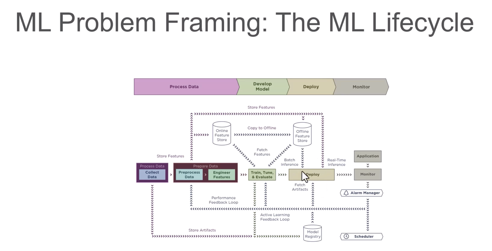

 ML Problem Framing: The ML Lifecycle.</code>
 <b>

 

</b>

 AWS Machine Learning Services.</code>
 <b>

| Service | Category | What It Does | When to Use |
|----------|-----------|--------------|-------------|
| **Amazon Augmented AI (A2I)** | Human-in-the-Loop Machine Learning | Integrates human review into ML predictions | When model outputs need human verification (sensitive documents, low-confidence predictions) |
| **Amazon Bedrock** | Generative AI | Run and scale generative AI models like GPT, Claude, and others on AWS infrastructure | Build generative AI apps without training your own large model |
| **Amazon CodeGuru** | Developer Productivity | Automated code reviews and performance recommendations | Optimize application performance and detect security issues |
| **Amazon Comprehend** | NLP/Text Analytics | Text analytics, sentiment analysis, entity recognition, and language processing | Extract meaning from unstructured text like reviews or emails |
| **Amazon Comprehend Medical** | Healthcare NLP | Extracts medical entities and codes (ICD-10, RxNorm) from unstructured medical text | Analyze clinical notes or health records in a HIPAA-compliant way |
| **Amazon DevOps Guru** | Operational Intelligence | Uses ML to automatically detect operational issues and anomalies in applications | Proactive monitoring and anomaly detection for app performance |
| **Amazon Fraud Detector** | Fraud Detection | Detect and prevent online fraud in real time | Transaction fraud, fake account sign-ups, or suspicious logins |
| **Amazon Forecast** | Time Series Forecasting | Predict future outcomes like financial metrics, inventory, and demand planning | Demand planning, resource allocation, and forecasting trends |
| **AWS HealthLake** | Healthcare AI | Process and analyze health-related data, store and transform data in HL7 FHIR format | Centralize, normalize, and analyze large volumes of healthcare data |
| **Amazon Kendra** | Enterprise Search | Enhances enterprise productivity with machine learning-powered contextual search across large data sources | Intelligent search across internal docs, FAQs, manuals |
| **Amazon Lex** | Conversational AI | Conversational AI for creating chatbots or voice bots for customer service and virtual assistants | Build chatbots or IVR systems integrated with AWS |
| **Amazon Lookout for Equipment** | Predictive Maintenance | Analyzes sensor data from industrial equipment to predict potential failures | Predictive maintenance for manufacturing, energy, or industrial operations |
| **Amazon Lookout for Metrics** | Anomaly Detection | Detection of anomalies in metrics like revenue, sales, and operational data | Monitor KPIs without manually setting thresholds |
| **Amazon Lookout for Vision** | Computer Vision | Detect quality defects in manufactured products with computer vision | Manufacturing quality control and defect detection |
| **Amazon Mechanical Turk** | Human Workforce / Data Labeling | Provides a global workforce for data labeling and human intelligence tasks | Human labeling, surveys, or manual data verification tasks |
| **Amazon Personalize** | Recommendations | Build personalized recommendations for users (e-commerce, media) | Personalized product/content recommendations |
| **Amazon Polly** | Speech AI | Text-to-speech conversion with lifelike voices for interactive applications | Add spoken audio to apps, IVR systems, or accessibility tools |
| **Amazon Q** | AI-Powered Business Assistant | Generative AI for your enterprise data and apps | Chat with enterprise data, automate workflows |
| **Amazon Rekognition** | Computer Vision | Image/video analysis, object detection, facial recognition, and label detection | Image/video classification, surveillance, and moderation |
| **Amazon SageMaker** | End-to-End ML Platform | Build, train, and deploy custom machine learning models | Full ML development lifecycle without managing servers |
| **Amazon Textract** | Document Processing | Extract text, tables, and forms from scanned documents | Digitize paper forms, invoices, or contracts |
| **Amazon Transcribe** | Speech-to-Text Conversion | Automatic transcription of spoken language from audio files | Transcribe calls, create subtitles, convert voice notes |
| **Amazon Translate** | NLP/Language Translation | Language translation across multiple languages | Real-time or batch translation of text or documents |
| **AWS Panorama** | Edge AI | Edge computer vision for analyzing on-premises video streams locally in low-latency environments | On-premise video analytics without sending data to the cloud |
| **Amazon CodeWhisperer** | Developer Productivity | AI-powered code suggestions and completions to enhance developer productivity | Speed up coding tasks and improve code quality |
| **AWS Q Business** | Business Optimization | Optimization and quantum-inspired solutions for solving complex computational problems in logistics, finance, and manufacturing | Solve optimization-heavy business problems |
| **AWS DeepLens** | Computer Vision/Hardware | Edge hardware for computer vision modeling and deployment | Develop and deploy CV models on physical hardware devices |
| **AWS Glue DataBrew** | Data Preparation | No-code data preparation for machine learning workflows and analytics | Clean and prepare data quickly for analytics or ML |
| **Amazon Neptune ML** | Graph Machine Learning | Use graph machine learning models to analyze relationships in highly connected data | Social networks, fraud detection, recommendation engines |

</b>

 Analytics Services (Data Transformation Integration and Feature Engineering Services).</code>
 <b>

# AWS Data Analytics & Processing Services

| **Component**                                 | **Purpose**                                               | **Use Cases**                                                                                               |
|----------------------------------------------|-----------------------------------------------------------|-------------------------------------------------------------------------------------------------------------|
| **Amazon Athena**                            | Serverless interactive query service                      | Run SQL queries directly on data stored in Amazon S3 without setting up infrastructure; ad-hoc analytics.   |
| **Amazon Data Firehose (Kinesis Data Firehose)** | Reliable streaming data delivery                         | Capture, transform, and load streaming data into data lakes, warehouses, and analytics services (e.g., S3, Redshift, OpenSearch). |
| **Amazon EMR**                               | Managed big data processing                               | Run large-scale data processing frameworks like Apache Spark, Hadoop, HBase, and Presto for analytics.       |
| **AWS Glue**                                 | Serverless data integration                               | Automate ETL (Extract, Transform, Load) for batch and streaming data pipelines.                              |
| **AWS Glue DataBrew**                        | No-code data preparation                                  | Visually clean, normalize, and transform datasets without coding for analytics and ML workflows.             |
| **AWS Glue Data Quality**                    | Data profiling and validation                             | Measure, monitor, and improve data quality with built-in rules and metrics.                                  |
| **Amazon Kinesis (Data Streams)**            | Real-time data ingestion and processing                   | Collect and process real-time streaming data like clickstreams, logs, and IoT telemetry.                     |
| **AWS Lake Formation**                       | Secure data lake creation and governance                  | Quickly build and manage secure data lakes with centralized access control and cataloging.                   |
| **Amazon Managed Service for Apache Flink**  | Real-time stream processing                               | Build and run stream-processing applications using Apache Flink without managing infrastructure.             |
| **Amazon OpenSearch Service**                | Managed search and analytics                               | Search, monitor, and analyze log or operational data with Elasticsearch-compatible APIs.                     |
| **Amazon QuickSight**                        | Business Intelligence (BI) and dashboards                 | Create interactive dashboards, reports, and embedded analytics with serverless scaling.                      |
| **Amazon Redshift**                          | Data warehouse for analytics                              | Run complex analytical queries on structured and semi-structured data at scale.                              |

</b>

 Lists AWS Glue components and their purposes and use cases.</code>
 <b>
# AWS Glue Components and Their Use Cases

| **Component**              | **Purpose**                                | **Use Cases**                                                                                 |
|----------------------------|--------------------------------------------|---------------------------------------------------------------------------------------------|
| **AWS Glue Data Catalog**  | Centralized metadata repository            | Stores metadata for all datasets, used for managing schemas and querying datasets with tools like Athena. |
| **AWS Glue Crawlers**      | Automatic schema discovery                 | Identifies and categorizes the structure and format of data in storage (e.g., S3, RDS, Redshift). |
| **AWS Glue ETL Jobs**      | Extract, Transform, Load (ETL) Operations  | Automates the process of extracting, transforming, and loading data with serverless functionality. |
| **AWS Glue Studio**        | Visual Interface for ETL Jobs              | Simplifies ETL job creation through a drag-and-drop interface designed for ease of use.       |
| **AWS Glue DataBrew**      | No-Code Data Preparation                   | Allows users to clean, normalize, and transform datasets visually without coding.             |
| **AWS Glue Workflows**     | Workflow Orchestration                     | Orchestrates complex ETL jobs, crawlers, and triggers in sequence or parallel workflows.      |
| **AWS Glue Triggers**      | Event-Based ETL Job Automation             | Automates running ETL, crawling, or workflows based on specific events or schedules.          |
| **AWS Glue Streaming ETL** | Real-Time Data Transformation              | Processes streaming data from sources like Amazon Kinesis or Apache Kafka for real-time transformations. |
| **AWS Glue Developer/API Access** | Programmatic ETL Job Creation       | Provides APIs and SDKs for developers to create custom ETL workflows using Python or Scala code. |
| **AWS Glue DPU (Data Processing Units)** | Scalable compute for jobs     | Provides distributed and scalable compute for handling large-scale data processing operations. |
| **AWS Glue Connections**   | Data Source Integration                    | Allows connectivity to external data stores like RDS, JDBC, or on-premises databases.         |
| **AWS Glue ML Transforms** | Machine Learning Transforms                | Automates significant transformations using machine learning techniques (e.g., deduplication, linkage). |
| **AWS Glue Schema Registry** | Schema Evolution Management             | Enables management, validation, and enforcement of schemas for streaming and batch data workflows. |
| **AWS Glue Partition Indexing** | Partition Optimization               | Optimizes querying large S3-based datasets with high granularity for faster performance.       |

</b>

 List all AWS SageMaker's components and their use cases for various purposes.</code>
 <b>
# Amazon SageMaker Components and Their Use Cases

| SageMaker Tool/Feature | Category | Use Case | Key Features |
| :-- | :-- | :-- | :-- |
| SageMaker Studio | Integrated Development Environment (IDE) | Allows data scientists and developers to build, train, debug, and deploy ML models in a unified interface. | A single web-based IDE for end-to-end machine learning workflows. |
| SageMaker Data Wrangler | Data Preparation and Feature Engineering | Simplifies data preparation, cleaning, and feature engineering for machine learning workflows. | Provides a GUI to transform and analyze data without writing code. |
| SageMaker Autopilot | Build Models Automatically | Automatically trains and tunes the best ML model based on your data while providing visibility into the process. | Full automation combined with transparency via generated notebooks showing every step. |
| SageMaker Training | Model Training | Trains ML models at scale with support for distributed training and custom training scripts. | Supports distributed training across GPUs/CPUs, customizable training jobs. |
| SageMaker Processing | Data Preprocessing and Post-processing | Run data preprocessing, post-processing tasks, or batch inference workloads using managed infrastructure. | Useful for handling data transformation tasks before and after ML training/inference. |
| SageMaker Feature Store | Feature Management | Centralize, create, and reuse features for ML models across teams and projects. | Enables real-time access to feature values for models during inference and provides lineage/history for feature creation. |
| SageMaker Debugger | Debugging and Insights | Analyzes and debugs training jobs by identifying performance bottlenecks and providing actionable insights. | Tracks resource utilization, gradients, loss curves, etc., for optimizing training performance. |
| SageMaker Model Monitor | Model Monitoring in Production | Detects deviations, concept drift, and anomalies in model predictions to ensure accurate and reliable production models. | Simplifies post-deployment monitoring to maintain model performance. |
| SageMaker Pipelines | Machine Learning Pipelines | Automates and orchestrates workflows for data preparation, model building, training, optimization, and deployment. | Streamlined ML workflow automation for enterprise-level scaling. |
| SageMaker Ground Truth | Data Labeling | Builds accurate ground truth datasets for supervised learning by enabling human labeling tasks or semi-automation. | Supports human labeling tasks and active learning frameworks. |
| SageMaker Neo | Model Optimization for Edge | Optimizes machine learning models to run faster and at lower latency on edge devices and hardware. | Converts models for compatibility across edge devices and enables hardware acceleration. |
| SageMaker JumpStart | Prebuilt Solutions and Models | Provides pre-trained models, solution templates, and example notebooks for various ML use cases. | Speeds up development with prebuilt templates for common use cases like recommendation systems, fraud detection, etc. |
| SageMaker Inference Recommender | Recommendation for Deployment | Automates the selection of the best resources for deploying machine learning models. | Analyzes deployment requirements to recommend EC2 instances or configurations for optimal performance and cost-effectiveness. |
| SageMaker Hosting/Inferences | Model Deployment and Inference | Deploys trained models as endpoints for real-time, batch, and asynchronous inference. | Fully managed service for scalable model inference in production settings. |
| SageMaker Clarify | Data Bias and Model Explainability | Detects bias in your data and explains model predictions for fairness and transparency. | Provides fairness metrics for datasets/models and interprets how features impact predictions. |
| SageMaker Model Registry | Centralized Model Repository | Tracks and manages ML models and their versions for streamlined deployment and governance. | Keeps detailed history of models and versioning for repeatable and auditable deployments. |
| SageMaker Marketplace | External Model Use | Allows you to use and deploy pre-trained machine learning models and algorithms from third-party vendors. | Facilitates the use of third-party professional models for niche domains or large-scale applications. |
| SageMaker Edge Manager | Edge Device Management | Deploys, manages, and monitors models on thousands of edge devices. | Enables large-scale model deployment and monitoring for IoT and edge devices. |
| SageMaker Experiment | Experiment Management | Organizes and tracks experiments to compare model performance across different runs and configurations. | Allows you to log and compare training jobs' metrics (e.g., hyperparameters, accuracy) for optimizing model development processes. |

</b>

 List AWS SageMaker built-in algorithms with their use cases.</code>
 <b>

# AWS SageMaker Built-In Algorithms and Their Use Cases

| Algorithm | Category | Use Case | Key Features |
| :-- | :-- | :-- | :-- |
| Linear Learner | Regression/Classification | Predicting trends, pricing models, fraud detection, and binary/multi-class classification problems. | Optimizes linear models and supports both regression and binary/multi-class classification tasks. |
| XGBoost | Regression/Classification | Predicting churn, forecasting, and natural language processing (NLP). | Highly efficient, scalable implementation of gradient-boosted decision trees for tabular datasets. |
| Factorization Machines | Recommendation Systems | Personalizing product recommendations, predicting customer behavior. | Used for recommendation engines (e.g., collaborative filtering) for sparse datasets. |
| Image Classification | Computer Vision | Classifying objects in images (e.g., face recognition, product categorization). | Pre-trained models optimized for image datasets; supports transfer learning. |
| Object Detection | Computer Vision | Detecting and locating objects in digital images and videos. | Detects bounding boxes and classes for objects in images (e.g., autonomous vehicles or scene detection). |
| Semantic Segmentation | Computer Vision | Image segmentation for medical imagery, self-driving cars, and video analysis. | Detects pixel-level segmentation for more precise visual understanding. |
| BlazingText | Natural Language Processing | Sentiment analysis, document categorization, and word embedding. | Optimized for word embedding tasks and text classification; supports fast text algorithms. |
| Sequence-to-Sequence | Natural Language Processing | Language translation, text summarization, and chatbot creation. | Translates or summarizes sequences, such as converting articles to abstracts using encoder-decoder models. |
| DeepAR | Time Series Forecasting | Forecasting stock prices, sales forecasting, and demand planning. | Designed for time-series forecasting on large volumes of historical data with probabilistic predictions. |
| K-Means Clustering | Clustering | Customer segmentation, anomaly detection, and data grouping. | Finds clusters within datasets for unsupervised learning tasks. |
| Principal Component Analysis | Dimensionality Reduction | Reducing dimensions in datasets for visualization and preprocessing. | Extracts principal components to reduce the dimensionality of datasets while retaining key information. |
| Neural Topic Modeling | Unsupervised Learning | Generating topics from text datasets and document collections. | Uses unsupervised learning to identify abstract topics in datasets based on text patterns. |
| Random Cut Forest (RCF) | Anomaly Detection | Fraud detection, network monitoring, and identifying unusual patterns. | Detects anomalies in time-series or tabular datasets automatically. |
| IP Insights | Fraud Detection | Identifying suspicious IP addresses in fraud detection workflows. | Learns IP address embeddings for detecting problematic or unauthorized activity. |
| Reinforcement Learning | Decision Making | Autonomous actions in robotics, game simulations, and optimization problems. | Supports reinforcement learning models like Deep Q-Learning or policy-gradient methods. |
| Matrix Factorization | Recommendation Systems | Collaborative filtering for personalized recommendations. | Specialized for sparse datasets in recommendation engines. |
| Training Algorithm Optimization (TAO) | Optimization | Automated optimization of training parameters and hyperparameters. | Finds the best configuration for training models to maximize performance. |
| Multinomial Logistic Regression | Classification | Multi-class classification problems such as labeling categories in text datasets. | Solves multi-class classification problems using regression techniques extended to multiple categories. |
| Confusion Matrix | Evaluation/Metric | Evaluating performance of classification models. | Provides a summary of model predictions by counting true positives, true negatives, false positives, and false negatives. Helpful for measuring accuracy, recall, precision, and F1-score. |

| Use Case | Mnemonic | Algorithms |
| :-- | :-- | :-- |
| Prediction Tasks | "Let's X-Ray the Data Deeply" | Linear Learner, XGBoost, DeepAR |
| Recommendation Systems | "Machines and Matrix Recommending Products" | Factorization Machines, Matrix Factorization |
| Computer Vision | "Images Objectively help Segment Vision" | Image Classification, Object Detection, Semantic Segmentation |
| Natural Language Processing (NLP) | "Blazing Sequences of Text" | BlazingText, Sequence-to-Sequence |
| Time Series Forecasting | "Time Runs Deep" | DeepAR |
| Dimensionality Reduction / Clustering | "Components Cluster" | Principal Component Analysis (PCA), K-Means Clustering |
| Anomaly and Fraud Detection | "Random IP Fraud" | Random Cut Forest (RCF), IP Insights |
| Decision Making / Optimization | "Train to Decide Reinforced Tasks" | Reinforcement Learning, Training Algorithm Optimization (TAO) |
| Evaluation | "Confused Class Evaluator" | Confusion Matrix |

</b>

 ML Model Evaluation and Optimization Techniques: When to Use.</code>
 <b>

| Technique | Type | When to Use |
| :-- | :-- | :-- |
| Confusion Matrix | Evaluation (Classification) | Use for evaluating models that perform classification tasks. Best for binary/multi-class classification metrics like accuracy, precision, recall, and F1-score. |
| Accuracy | Evaluation (Classification) | Use as a summary metric when the dataset is balanced (equal representation of classes). |
| Precision | Evaluation (Classification) | Use when false positives matter more (e.g., fraud detection). |
| Recall (Sensitivity) | Evaluation (Classification) | Use when false negatives matter more (e.g., cancer diagnosis). |
| F1-Score | Evaluation (Classification) | Use when there is an imbalance between precision and recall trade-off (harmonic mean of both). |
| AUC-ROC Curve | Evaluation (Classification) | Use for binary classification problems to evaluate the trade-off between sensitivity (recall) and specificity. |
| Mean Absolute Error (MAE) | Evaluation (Regression) | Use to evaluate how far predictions are from actual values in regression tasks when all errors are treated equally. |
| Mean Squared Error (MSE) | Evaluation (Regression) | Use for regression when larger errors need to be penalized higher (squared losses). |
| R^2 (Coefficient of Determination) | Evaluation (Regression) | Use to measure how much variance in the output is explained by the input features. |
| Cross-Validation | Evaluation/Optimization | Use to validate model performance across multiple data splits (e.g., k-fold CV). Helps ensure generalization. |
| Grid Search | Optimization | Use to systematically find the best hyperparameters when manually defining a small hyperparameter space. |
| Random Search | Optimization | Use when hyperparameter optimization needs to balance exploration and efficiency over a large search space. |
| Bayesian Optimization | Optimization | Use for efficient hyperparameter tuning with probabilistic models to balance exploration/exploitation. |
| Gradient Descent Variants (SGD, Adam, etc.) | Optimization | Use to optimize a model’s weights during training (e.g., neural network optimization). |
| Hyperparameter Tuning (Manual) | Optimization | Use when testing a few configurations manually for small models (often combined with domain knowledge). |
| Early Stopping | Optimization | Use to stop training when the validation loss stops improving to avoid overfitting. |
| Ensemble Methods (Bagging, Boosting) | Optimization | Use when improving performance by combining multiple models (e.g., Random Forest, XGBoost). |
| Transfer Learning | Optimization | Use when reusing pre-trained models for similar tasks to improve performance without training from scratch. |
| Regularization (L1, L2) | Optimization | Use to prevent overfitting by penalizing large weights during model training (adds constraints). |
| Feature Engineering | Optimization (Preprocessing) | Use to improve model performance by transforming, selecting, or extracting relevant features from raw data. |
| Dimensionality Reduction (PCA) | Optimization (Preprocessing) | Use to remove redundant features or reduce noise in datasets with high-dimensional inputs. |
| Model Monitoring | Post-Deployment | Use to monitor model performance in production over time (concept drift, data drift). |
| Bias and Fairness Detection | Evaluation (Explainability) | Use to ensure fairness across demographic groups or prevent discrimination in predictions (e.g., SageMaker Clarify). |
| SHAP/Feature Importance | Evaluation (Explainability) | Use when needing interpretability to understand the impact of individual features on predictions. |
| Batch Normalization | Optimization | Use for scaling and normalizing inputs in deep learning models to stabilize and improve training speed. |
| Data Augmentation | Optimization (Preprocessing) | Use to increase the size and diversity of training data, especially for computer vision and NLP tasks. |

</b>

 Bullet points for Frame ML problem.</code>
 <b>
  
### Establish ML Roles and Responsibilities
- SageMaker Role Manager

### Prepare an ML Profile Template
- Document the resources required

### Establish Model Improvement Strategies
- SageMaker Experiments
- Hyper-parameter optimization
- AutoML

### Establish a Lineage Tracker System
- SageMaker Lineage Tracking
- Pipelines
- Studio
- Feature Store
- Model Registry

### Establish Feedback Loops Across ML Lifecycle Phases
- SageMaker Model Monitor
- CloudWatch
- Amazon Augmented AI (A2I)

### Review Fairness and Explainability
- SageMaker Clarify

---

### Design Data Encryption and Obfuscation
- Glue DataBrew

### Use APIs to Abstract Change from Model Consuming Applications
- SageMaker + API Gateway

### Adopt a Machine Learning Microservice Strategy
- Lambda
- FarGate

### Use Purpose-Built AI and ML Services and Resources
- SageMaker
- JumpStart
- Marketplace

### Define Relevant Evaluation Metrics

### Identify if Machine Learning is the Right Solution

### Tradeoff Analysis on Custom versus Pre-trained Models

</b>

---
# AWS Machine Learning Associate Exam - SageMaker Questions and Answers

Which SageMaker component is used to visually prepare and transform datasets without writing code?
 <b>

**Options:**
- **A.** SageMaker Processing  
- **B.** SageMaker Studio  
- **C.** SageMaker Data Wrangler  
- **D.** SageMaker Autopilot  

**Answer:**  
**C. SageMaker Data Wrangler**

**Explanation:**  
SageMaker Data Wrangler provides a visual, no-code interface to prepare, clean, and transform datasets for machine learning workflows.

</b>

What is the primary purpose of SageMaker Model Monitor?
 <b>

**Options:**
- **A.** Automate data labeling for supervised learning.  
- **B.** Debug model training jobs for performance bottlenecks.  
- **C.** Detect model prediction drift and anomalies in production.  
- **D.** Optimize models for edge devices.  

**Answer:**  
**C. Detect model prediction drift and anomalies in production**

**Explanation:**  
SageMaker Model Monitor detects changes in incoming data, concept drift, or anomalies in model predictions, ensuring the deployed model's accuracy over time.

</b>

Which SageMaker feature allows you to orchestrate an end-to-end machine learning workflow, including data preparation, training, and deployment?
 <b>

**Options:**
- **A.** SageMaker Autopilot  
- **B.** SageMaker Processing Jobs  
- **C.** SageMaker Pipelines  
- **D.** SageMaker Debugger  

**Answer:**  
**C. SageMaker Pipelines**

**Explanation:**  
SageMaker Pipelines is used to automate and orchestrate the entire ML workflow, including data preparation, feature engineering, model training, tuning, and deployment.

</b>

Which feature in SageMaker is specifically designed for training jobs to detect performance issues during model training?
 <b>

**Options:**
- **A.** SageMaker Debugger  
- **B.** SageMaker Processing  
- **C.** SageMaker Pipelines  
- **D.** SageMaker Model Monitor  

**Answer:**  
**A. SageMaker Debugger**

**Explanation:**  
SageMaker Debugger provides tools to debug and monitor training jobs, identifying performance issues like underfitting, overfitting, and hardware bottlenecks during training.

</b>

What is the purpose of the SageMaker Feature Store?
 <b>

**Options:**
- **A.** To preprocess data for machine learning models.  
- **B.** To store, share, and reuse features across teams and workflows.  
- **C.** To automate model training.  
- **D.** To deploy models to edge devices.  

**Answer:**  
**B. To store, share, and reuse features across teams and workflows**

**Explanation:**  
The SageMaker Feature Store allows you to create, manage, and share reusable features across different teams and ML projects, ensuring consistency and efficiency.

</b>

You need to train a machine learning model on a large dataset that doesn't fit in memory. Which SageMaker feature would you use?
 <b>

**Options:**
- **A.** SageMaker Pipelines  
- **B.** SageMaker Training with Pipe Mode  
- **C.** SageMaker Autopilot  
- **D.** SageMaker Debugger  

**Answer:**  
**B. SageMaker Training with Pipe Mode**

**Explanation:**  
SageMaker Training with **Pipe Mode** streams data directly from Amazon S3 to training algorithms, eliminating the need to fit the entire dataset into memory.

</b>

Which SageMaker feature should you use to automatically generate an ML model without writing custom algorithms?
 <b>

**Options:**
- **A.** SageMaker Studio  
- **B.** SageMaker Data Wrangler  
- **C.** SageMaker Autopilot  
- **D.** SageMaker Feature Store  

**Answer:**  
**C. SageMaker Autopilot**

**Explanation:**  
SageMaker Autopilot automatically trains and tunes models based on your dataset while providing transparency into the models and underlying processes.

</b>

Which file format is recommended for distributed training in SageMaker?
 <b>

**Options:**
- **A.** CSV files stored in S3 buckets  
- **B.** JSON files stored in DynamoDB  
- **C.** RecordIO files in augmented manifest format  
- **D.** Parquet files stored in S3 buckets  

**Answer:**  
**C. RecordIO files in augmented manifest format**

**Explanation:**  
The RecordIO format in the augmented manifest format is ideal for efficient distributed training as it provides faster reading and processing of large datasets.

</b>

How can you deploy a trained SageMaker model for real-time inference?
 <b>

**Options:**
- **A.** Use SageMaker Processing  
- **B.** Deploy the model to a SageMaker Endpoint  
- **C.** Use SageMaker Data Wrangler  
- **D.** Integrate the model with Lambda directly  

**Answer:**  
**B. Deploy the model to a SageMaker Endpoint**

**Explanation:**  
SageMaker Endpoints allow you to deploy trained models for real-time inference and handle production workloads efficiently.

</b>

Which SageMaker component can be used to label datasets for supervised machine learning?
 <b>

**Options:**
- **A.** SageMaker Model Monitor  
- **B.** SageMaker Ground Truth  
- **C.** SageMaker Autopilot  
- **D.** SageMaker JumpStart  

**Answer:**  
**B. SageMaker Ground Truth**

**Explanation:**  
SageMaker Ground Truth is used to label datasets either through human annotation or semi-automated processes, which is critical for building supervised learning models.

</b>

What is SageMaker Neo used for?
 <b>

**Options:**
- **A.** Optimizing models for deployment to edge devices.  
- **B.** Debugging underperforming training jobs.  
- **C.** Preprocessing raw data for model training.  
- **D.** Managing the storage of feature data.  

**Answer:**  
**A. Optimizing models for deployment to edge devices**

**Explanation:**  
SageMaker Neo helps optimize ML models to run on edge devices with reduced latency and lower resource consumption.

</b>

Which SageMaker feature is recommended for batch inference use cases?
 <b>

**Options:**
- **A.** SageMaker Training  
- **B.** SageMaker Processing  
- **C.** SageMaker Transform Jobs  
- **D.** SageMaker Debugger  

**Answer:**  
**C. SageMaker Transform Jobs**

**Explanation:**  
SageMaker Transform Jobs are specifically designed for non-real-time batch inference tasks where predictions need to be made on large datasets.

</b>

What is the purpose of SageMaker JumpStart?
 <b>

**Options:**
- **A.** Automate and deploy prebuilt ML models for common business problems.  
- **B.** Debug training pipelines for faster iteration cycles.  
- **C.** Store reusable ML features for later use.  
- **D.** Create end-to-end workflows for data preprocessing and training.  

**Answer:**  
**A. Automate and deploy prebuilt ML models for common business problems**

**Explanation:**  
SageMaker JumpStart provides pre-trained models, examples, and templates to help you quickly build and deploy machine learning solutions for common use cases.

</b>

---
# AWS Machine Learning Associate Exam - SageMaker Built-In Algorithms Questions and Answers

Which SageMaker algorithm is best suited for creating product recommendation systems using sparse datasets?
 <b>

**Options:**
- **A.** Linear Learner  
- **B.** Factorization Machines  
- **C.** K-Means Clustering  
- **D.** Random Cut Forest  

**Answer:**  
**B. Factorization Machines**

**Explanation:**  
Factorization Machines are designed for sparse datasets and are frequently used in recommendation systems, predicting user preferences based on historical data.

</b>

You want to segment customers into groups based on purchasing behavior. Which SageMaker algorithm should you use?
 <b>

**Options:**
- **A.** Principal Component Analysis (PCA)  
- **B.** K-Means Clustering  
- **C.** Neural Topic Modeling  
- **D.** DeepAR  

**Answer:**  
**B. K-Means Clustering**

**Explanation:**  
K-Means Clustering is an unsupervised learning algorithm used for customer segmentation, grouping similar customers based on shared behaviors.

</b>

Which algorithm would you use to forecast sales trends or stock prices using time-series data in SageMaker?
 <b>

**Options:**
- **A.** DeepAR Forecasting  
- **B.** Neural Topic Modeling  
- **C.** Linear Learner  
- **D.** Multinomial Logistic Regression  

**Answer:**  
**A. DeepAR Forecasting**

**Explanation:**  
DeepAR is specifically designed for probabilistic time-series forecasting and is well-suited for predicting trends in sales, stock prices, and demand planning.

</b>

Which SageMaker algorithm is best used to identify anomalous patterns in data, such as fraud detection or network monitoring?
 <b>

**Options:**
- **A.** Random Cut Forest  
- **B.** XGBoost  
- **C.** K-Means Clustering  
- **D.** PCA  

**Answer:**  
**A. Random Cut Forest**

**Explanation:**  
Random Cut Forest (RCF) is optimized for anomaly detection in tabular and time-series datasets, making it ideal for identifying fraudulent activities or network anomalies.

</b>

Which built-in algorithm is the most suitable for multi-class classification tasks?
 <b>

**Options:**
- **A.** Linear Learner  
- **B.** Multinomial Logistic Regression  
- **C.** BlazingText  
- **D.** Factorization Machines  

**Answer:**  
**B. Multinomial Logistic Regression**

**Explanation:**  
Multinomial Logistic Regression is ideal for multi-class classification problems where there are more than two categories to predict.

</b>

You're working with image classification on SageMaker to label objects in photos. Which algorithm should be used?
 <b>

**Options:**
- **A.** Object Detection  
- **B.** BlazingText  
- **C.** Image Classification  
- **D.** Semantic Segmentation  

**Answer:**  
**C. Image Classification**

**Explanation:**  
The Image Classification algorithm is built to categorize objects into predefined labels using image datasets.

</b>

Which SageMaker algorithm is used when predicting the relationship between features and a continuous numeric target variable?
 <b>

**Options:**
- **A.** XGBoost  
- **B.** Linear Learner  
- **C.** DeepAR Forecasting  
- **D.** Sequence-to-Sequence  

**Answer:**  
**B. Linear Learner**

**Explanation:**  
Linear Learner is well-suited for regression problems that involve predicting a continuous target variable based on input features.

</b>

Which algorithm is suitable for reducing the dimensionality of large datasets while retaining key information?
 <b>

**Options:**
- **A.** Neural Topic Modeling  
- **B.** Principal Component Analysis (PCA)  
- **C.** K-Means Clustering  
- **D.** Random Cut Forest  

**Answer:**  
**B. Principal Component Analysis (PCA)**

**Explanation:**  
PCA is designed for dimensionality reduction, simplifying large datasets while keeping the most important statistical information.

</b>

You need to predict customer churn using tabular datasets with a high number of features. Which SageMaker algorithm is most appropriate?
 <b>

**Options:**
- **A.** Neural Topic Modeling  
- **B.** XGBoost  
- **C.** Factorization Machines  
- **D.** DeepAR  

**Answer:**  
**B. XGBoost**

**Explanation:**  
XGBoost is highly efficient for tabular data and performs well in predictive modeling tasks such as customer churn and forecasting.

</b>

Which SageMaker algorithm should you use for word embedding and text classification tasks?
 <b>

**Options:**
- **A.** Sequence-to-Sequence  
- **B.** BlazingText  
- **C.** Neural Topic Modeling  
- **D.** Linear Learner  

**Answer:**  
**B. BlazingText**

**Explanation:**  
BlazingText is optimized for word embeddings and text classification tasks, such as document categorization or sentiment analysis.

</b>

A logistics company needs to optimize delivery routes and reduce costs. Which SageMaker algorithm can be applied?
 <b>

**Options:**
- **A.** Linear Learner  
- **B.** Factorization Machines  
- **C.** Sequence-to-Sequence  
- **D.** Reinforcement Learning  

**Answer:**  
**D. Reinforcement Learning**

**Explanation:**  
Reinforcement Learning is perfect for decision-making tasks, such as optimizing delivery routes or dynamic logistics planning.

</b>

Which algorithm is appropriate for extracting topics from text datasets or collections of documents?
 <b>

**Options:**
- **A.** Neural Topic Modeling  
- **B.** BlazingText  
- **C.** Sequence-to-Sequence  
- **D.** Random Cut Forest  

**Answer:**  
**A. Neural Topic Modeling**

**Explanation:**  
Neural Topic Modeling identifies abstract topics in text datasets using unsupervised learning techniques.

</b>

Which algorithm should you use to locate objects in digital images and detect their bounding boxes?
 <b>

**Options:**
- **A.** Semantic Segmentation  
- **B.** Object Detection  
- **C.** Image Classification  
- **D.** PCA  

**Answer:**  
**B. Object Detection**

**Explanation:**  
Object Detection identifies objects in images and outputs their bounding boxes and associated classes.

</b>

You want to reduce overfitting in a text classification model using the built-in SageMaker algorithm. Which algorithm can be used for this?
 <b>

**Options:**
- **A.** BlazingText  
- **B.** Linear Learner  
- **C.** XGBoost  
- **D.** Sequence-to-Sequence  

**Answer:**  
**A. BlazingText**

**Explanation:**  
BlazingText applies techniques like regularization and dropout to minimize overfitting in text classification models.

</b>

---

What is the purpose of feature engineering in machine learning workflows?
 <b>

**Options:**
- **A.** Simplify model deployment  
- **B.** Improve data storage efficiency  
- **C.** Select, transform, and prepare data for training  
- **D.** Manage training infrastructure  

**Answer:**  
**C. Select, transform, and prepare data for training**

**Explanation:**  
Feature engineering involves selecting, transforming, and pre-processing data to make it suitable for training a machine learning model. It is a crucial step in creating high-quality datasets that improve model accuracy.
</b>

Which AWS service is most suitable for cleaning and normalizing data through a no-code interface?
 <b>

**Options:**
- **A.** Amazon SageMaker  
- **B.** AWS Glue DataBrew  
- **C.** Amazon EMR  
- **D.** AWS Data Pipeline  

**Answer:**  
**B. AWS Glue DataBrew**

**Explanation:**  
AWS Glue DataBrew provides a visual, no-code interface to clean, normalize, and transform data. It is specifically designed for users who require an easy-to-use tool for data preparation without writing complex scripts.
</b>

You query data stored in Amazon S3 using SQL for lightweight transformation. Which AWS service should you choose?
 <b>

**Options:**
- **A.** Amazon Athena  
- **B.** AWS Glue  
- **C.** AWS Step Functions  
- **D.** Amazon Kinesis Data Analytics  

**Answer:**  
**A. Amazon Athena**

**Explanation:**  
Amazon Athena is a serverless SQL-based query service that allows you to perform lightweight transformations and analysis directly on data stored in Amazon S3.
</b>

Which AWS service enables on-the-fly data preprocessing and transformation for machine learning workflows?
 <b>

**Options:**
- **A.** Amazon S3  
- **B.** Amazon SageMaker Data Wrangler  
- **C.** AWS Glue Studio  
- **D.** Amazon Redshift  

**Answer:**  
**B. Amazon SageMaker Data Wrangler**

**Explanation:**  
SageMaker Data Wrangler simplifies data preparation and feature engineering by providing an interactive interface for pre-processing datasets and exporting them directly into the machine learning pipeline.
</b>

How can you ensure data integrity during ETL (Extract, Transform, Load) processes?
 <b>

**Options:**
- **A.** Use Amazon CloudWatch to trigger metrics  
- **B.** Implement checksums or hashes during data transfer  
- **C.** Use AWS Auto Scaling to handle data overflow  
- **D.** Configure Amazon S3 bucket logging  

**Answer:**  
**B. Implement checksums or hashes during data transfer**

**Explanation:**  
Data integrity can be preserved by implementing validation mechanisms like checksums or hashes during and after the data transfer. AWS services like AWS Glue and Amazon S3 integrate integrity checks automatically during certain operations.
</b>

You need to join multiple datasets and transform them for downstream analysis. Which AWS service is the most suitable?
 <b>

**Options:**
- **A.** Amazon Athena  
- **B.** AWS Glue  
- **C.** Amazon Kinesis Data Streams  
- **D.** Amazon QuickSight  

**Answer:**  
**B. AWS Glue**

**Explanation:**  
AWS Glue is specifically designed for ETL operations required to join, clean, and transform data from multiple sources. It automates workflows and supports transformation at scale.
</b>

You are preparing a dataset for a regression model. Which preprocessing steps should you perform? (Select TWO)
 <b>

**Options:**
- **A.** One-hot encode categorical features  
- **B.** Normalize continuous features  
- **C.** Apply dropout techniques to the dataset  
- **D.** Use k-means clustering on the dataset  
- **E.** Convert text features to binary files  

**Answer:**  
**A. One-hot encode categorical features**  
**B. Normalize continuous features**

**Explanation:**  
For regression models:
- **One-hot encoding** is used to convert categorical variables into binary format.  
- **Normalization** scales continuous features to bring them within the same range, improving convergence during training.
</b>

Which AWS service would you use for real-time data transformation in streaming pipelines?
 <b>

**Options:**
- **A.** Amazon Kinesis Data Analytics  
- **B.** AWS Glue  
- **C.** Amazon QuickSight  
- **D.** Amazon S3  

**Answer:**  
**A. Amazon Kinesis Data Analytics**

**Explanation:**  
Amazon Kinesis Data Analytics allows you to process and transform streaming data in real-time using SQL, making it an ideal choice for real-time transformations.
</b>

Which technique would you use to handle missing data in a dataset? (Select TWO)
 <b>

**Options:**
- **A.** Impute missing values with the median or mean  
- **B.** Use SageMaker Debugger to detect missing data  
- **C.** Remove rows or columns with missing values  
- **D.** Use SageMaker Model Monitoring for missing data adjustments  

**Answer:**  
**A. Impute missing values with the median or mean**  
**C. Remove rows or columns with missing values**

**Explanation:**  
Handling missing data is essential for clean datasets:
- Imputing replaces missing values with the mean or median.
- Removing rows or columns is used when missing data is substantial and cannot be meaningfully imputed.
</b>

Which AWS service would you use to orchestrate complex ETL workflows across multiple services?
 <b>

**Options:**
- **A.** AWS Step Functions  
- **B.** AWS Glue DataBrew  
- **C.** Amazon SageMaker  
- **D.** Amazon EMR  

**Answer:**  
**A. AWS Step Functions**

**Explanation:**  
AWS Step Functions is a workflow orchestration service that integrates with multiple AWS services, such as Glue, Lambda, and SageMaker, to enable seamless ETL pipeline execution.
</b>

Which data integrity mechanism can ensure transformed datasets match the original source datasets in AWS Glue?
 <b>

**Options:**
- **A.** Implement AWS Glue crawlers  
- **B.** Configure job bookmarks in Glue  
- **C.** Use S3 Versioning and data validation scripts  
- **D.** Utilize Amazon EMR’s Auto Scaling feature  

**Answer:**  
**C. Use S3 Versioning and data validation scripts**

**Explanation:**  
Versioning in Amazon S3, combined with validation scripts for checksums or row counts, ensures that transformed datasets retain data integrity against their original source datasets during Glue workflows.
</b>

What is a key reason to use feature scaling in machine learning workflows?
 <b>

**Options:**
- **A.** To improve the interpretability of trained models  
- **B.** To handle highly skewed datasets  
- **C.** To ensure all features contribute equally to model training  
- **D.** To reduce dataset size for faster computation  

**Answer:**  
**C. To ensure all features contribute equally to model training**

**Explanation:**  
Feature scaling ensures equal contribution by bringing all feature values into the same range. This is crucial for models like Logistic Regression or Neural Networks that are sensitive to feature magnitudes.
</b>

Which AWS service specifically supports feature engineering by creating embeddings for structured relationship data?
 <b>

**Options:**
- **A.** Amazon SageMaker Processing  
- **B.** Amazon Neptune ML  
- **C.** AWS Data Pipeline  
- **D.** Amazon Kinesis Data Firehose  

**Answer:**  
**B. Amazon Neptune ML**

**Explanation:**  
Amazon Neptune ML leverages graph neural networks to generate embeddings for conducting machine learning on highly connected datasets, such as social networks or recommendation systems.
</b>

