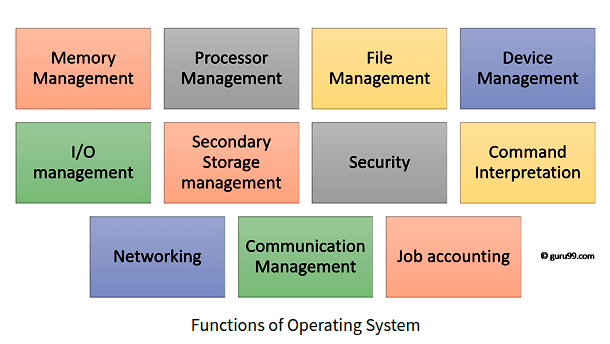
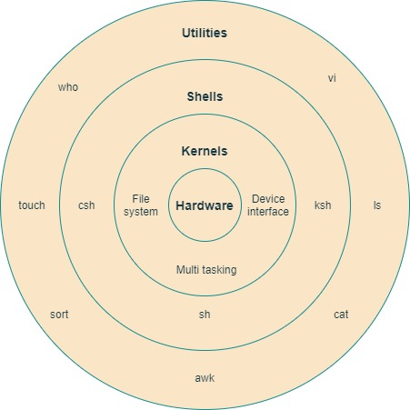
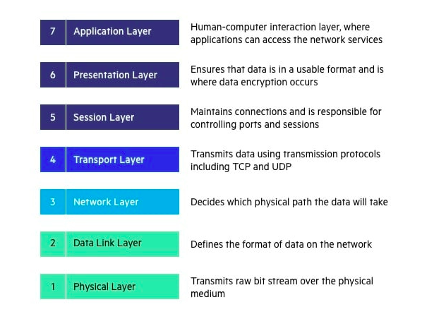
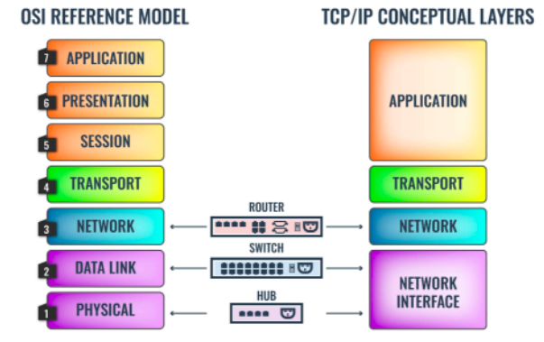

### Linux 
--------------------------------------------------------------------------------------

Prompt Customization.</code>
 <b>

Ubuntu
`sudo vi .bashrc` : `PS1="\[\033[01;32m\]\d \T \[\033[00m\]\$"`

Mac bash_profile file 
`export PS1="Dhirendra @\d \T $" ` & ` export PS1=”\u@\d \T $” `
</b>

What is Operating System ?.</code>
 <b>

Operating system is an interface between user and the computer hardware. The hardware of the computer cannot understand the human readable language as it works on binaries i.e. 0's and 1's. Also it is very tough for humans to understand the binary language, in such case we need an interface which can translate human language to hardware and vice-versa for effective communication. 

* <b> Types of Operating System:</b>  
  * Single User - Single Tasking Operating System  
  * Single User - Multitasking Operating System  
  * Multi User - Multitasking Operating System  
</b>

Functions of OS ?.</code>
 <b>

 OS functions may include managing memory, files, processes, I/O system & devices, security, etc.

 

In an operating system software performs each of the function:

- `Process management`: It helps OS to create and delete processes. It also provides mechanisms for synchronization and communication among processes.
- `Memory management`: It performs the task of allocation and de-allocation of memory space to programs in need of this resources.
- `File management`: It manages all the file-related activities such as organization storage, retrieval, naming, sharing, and protection of files.
- `Device Management`: It keeps tracks of all devices. This module also responsible for this task is known as the I/O controller. It also performs the task of allocation and de-allocation of the devices.
- `I/O System Management`: One of the main objects of any OS is to hide the peculiarities of that hardware devices from the user.
- `Secondary-Storage Management`: Systems have several levels of storage which includes primary storage, secondary storage, and cache storage. Instructions and data must be stored in primary storage or cache so that a running program can reference it.
- `Security`: it protects the data and information of a computer system against malware threat and authorized access.
- `Command interpretation`: it interprets the commands given by the and acting system resources to process that commands.
- `Networking`: A distributed system is a group of processors which do not share memory, hardware devices, or a clock. The processors communicate with one another through the network.

- `Job accounting`: Keeping track of time & resource used by various job and users.

- `Communication management`: Coordination and assignment of compilers, interpreters, and another software resource of the various users of the computer systems.

</b>

Features of OS ?.</code>
 <b>

- Protected and supervisor mode.
- Allows disk access and file systems Device drivers Networking Security.
- Program Execution.
- Memory management Virtual Memory Multitasking.
- Handling I/O operations.
- Manipulation of the file system.
- Error Detection and handling.
- Resource allocation.
- Information and Resource Protection.

</b>

What is Linux?.</code>
 <b>

Linux is an operating system based on UNIX and was first introduced by Linus Torvalds. It is based on the Linux Kernel and can run on different hardware platforms manufactured by Intel, MIPS, HP, IBM, SPARC, and Motorola. Another popular element in Linux is its mascot, a penguin figure named Tux.
</b>

Linux Architecture.</code>
 <b>

* The architecture of UNIX can be divided into Four levels of functionality, as shown in Figure .  

 

#### Hardware  
Hardware consists of all physical devices attached to the System.   
<b>Example:-</b> Hard disk drive, RAM, Motherboard, CPU etc.

#### Kernel 
The kernel is the central component of a computer operating systems. The only job performed by the kernel is to the manage the communication between the software and the hardware. A Kernel is at the nucleus of a computer. It makes the communication between the hardware and software possible. While the Kernel is the innermost part of an operating system, a shell is the outermost one.

#### Different types of the kernel are:  

- `Monolithic Kernel` : A monolithic kernel is a single code or block of the program. It provides all the required services offered by the operating system. It is a simplistic design which creates a distinct communication layer between the hardware and software.

- `Micro kernels`  : Microkernel manages all system resources. In this type of kernel, services are implemented in different address space. The user services are stored in user address space, and kernel services are stored under kernel address space. So, it helps to reduce the size of both the kernel and operating system.

- `Hybrid kernels `
- `Exo kernels  `

#### Features of Kernel
- `Low-level scheduling of processes`
- `Inter-process communication`
- `Process synchronization`
- `Context switching`

#### Shell  
Shell is the interface which takes input from users and sends instructions to the Kernel, Also takes the output from Kernel and send the result back to output user and starting applications.  
  * Types of shells are classified into four:
    * `Korn shell`
    * `Bourne shell`
    * `C shell`

#### Utilities  
Utilities provides the functionalities of an operating system to the users. 

</b>

What is OSI model & it's Layers?.</code>
 <b>

The Open Systems Interconnection (OSI) model describes seven layers that computer systems use to communicate over a network. It was the first standard model for network communications, adopted by all major computer and telecommunication companies in the early 1980s.

The modern Internet is not based on OSI, but on the simpler TCP/IP model. However, the OSI 7-layer model is still widely used, as it helps visualize and communicate how networks operate, and helps isolate and troubleshoot networking problems.

  * All --> People --> Seem --> To --> Need--> Data --> Processing "Application to physical"

 

 

</b>

Linux File System Hierarchy.</code>
 <b>

|Path     | Description        |
|:-----: |:---      |
| / |It is parent directory for all other directories.(root directory)|
| /root | It is home directory for root user and it provides working environment for root user|
| /home | It is home directory for other users and it provide working environment for other users|
| /boot |It contains bootable files for Linux. Like `GRUB (GRand Unified Boot loader)  boot.ini, ntldr` |
| /etc | It contains all configuration files. Like `User info /etc/passwd` |
| /usr | By default softwares are installed in /usr directory|
| /opt | It is optional directory for /usr and it contains third party softwares. |
| /bin | It contains commands used by all users(Binary files)|   
| /sbin | It contains commands used by only Super User (root) |
| /dev | It contains device file like `hard disk /dev/hda` |
| /proc |  It contain process files and data are not permanent, they keep changing like `information of CPU /proc/cpuinfo` |
| /var |It is containing variable data like `mails, log files` |   
| /mnt |It is default mount point for any partition. It is empty by default |
| /media |It contains all of removable media like `CD-ROM, pen drive` |
| /lib | It contains library files which are used by OS. Library files in Linux are shared object files|

</b>

What is the difference between UNIX and LINUX?.</code>
 <b>

Unix originally began as a propriety operating system from Bell Laboratories, which later on spawned into different commercial versions. On the other hand, Linux is free, open source and intended as a non-propriety operating system for the masses.
</b>

What is BASH?.</code>
 <b>

BASH is short for Bourne Again SHell, was written by Steve Bourne as a replacement to the original Bourne Shell(represented by /bin/sh). It combines all the features from the original version of Bourne Shell, plus additional functions to make it easier and more convenient to use. It has since been adapted as the default shell for most systems running Linux.
</b>

 What is LILO?.</code>
 <b>

LILO is a boot loader for Linux. It is used mainly to load the Linux operating system into main memory so that it can begin its operations.
</b>

 What is a swap space?.</code>
 <b>

Swap space is a certain amount of space used by Linux to temporarily hold some programs that are running concurrently. This happens when RAM does not have enough memory to hold all programs that are executing.
</b>

 What is the basic difference between BASH and DOS?.</code>
 <b>

The key differences between the BASH and DOS console lie in 3 areas:

* BASH commands are case sensitive while DOS commands are not;

* Under BASH, / character is a directory separator and \ acts as an escape character. Under DOS, / serves as a command argument delimiter and \ is the directory separator

* DOS follows a convention in naming files, which is 8 character file name followed by a dot and 3 characters for the extension. BASH follows no such convention.
</b>

 What is the importance of the GNU project?.</code>
 <b>

This so-called Free software movement allows several advantages, such as the freedom to run programs for any purpose and freedom to study and modify a program to your needs. It also allows you to redistribute copies of software to other people, as well as the freedom to improve software and have it released for the public.
</b>

 Describe the root account.</code>
 <b>

The root account is like a systems administrator account and allows you full control of the system.
Here you can create and maintain user accounts, assigning different permissions for each account.
It is the default account every time you install Linux.
</b>

 What is CLI?.</code>
 <b>

CLI is short for Command Line Interface. This interface allows the user to type declarative commands to instruct the computer to perform operations. CLI offers greater flexibility. However, other users who are already accustomed to using GUI find it difficult to remember commands including attributes that come with it.

</b>

What Happens When You Type google.com Or Any Other URL In Your Browser And Press Enter ? .</code>
 <b>

A webpage is basically a text file formatted a certain way so that your browser (ie. Chrome, Firefox, Safari, etc) can understand it; this format is called HyperText Markup Language (HTML). These files are located in computers that provide the service of storing said files and wait for someone to need them to deliver them. They are called servers because they serve the content that they hold to whoever needs it.

These servers can vary in classes, the most common and the one that we'll be talking about in the main portion of this article is a web server, the one that serves web pages. We can also find application servers, which are the ones that hold an application base code that will then be used to interact with a web browser or other applications. Database servers are also out there, which are the ones that hold a database that can be updated and consulted when needed.

These servers in order to deliver their content, much like in physical courier services, need to have an address so that the person needing said content can make a "letter" requesting the delivery; the person requesting the content in turn also has an address where the server can deliver the content to. These addresses are called IP (Internet Protocol) Address, a set of 4 numbers that range from 0 to 255 (one byte) separated by periods (ie. 127.0.0.1).

Another concept that is important to know is that the courier service traffic for the delivery can be one of two: Transmission Control Protocol (TCP) and User Datagram Protocol (UDP). Each one determines the way the content of a server is served, or delivered.

TCP is usually used to deliver static websites such as Wikipedia or Google and also email services and to download files to your computer because TCP makes sure that all the content that is needed gets delivered. It accomplishes this by sending the file in small packets of data and along with each packet a confirmation to know that the packet was delivered; that's why if you are ever downloading something and your internet connection suddenly drops when it comes back up you don't have to start over because the server would know exactly how many packets you have and how many you still need to receive. The downside to TCP is that because it has to confirm whether you got the packet or not before sending the next, it tends to be slower.

UDP, on the other hand, is usually used to serve live videos or online games. This is because UDP is a lot faster than TCP since UDP does not check if the information was received or not; it is not important. The only thing UDP cares about is sending the information. That is the reason why if you've ever watched a live video and if either your internet connection or the host's drops, you would just stop seeing the content; and when the connection comes back up you will only see the current stream of the broadcast and what was missed is forever lost. This is also true for online videogames (if you've played them you know exactly what this means)

What actually happens...

So back to the main question of what happens when you type www.google.com or any other URL (Uniform Resource Locator) in your web browser and press Enter. So the first thing that happens is that your browser looks up in its cache to see if that website was visited before and the IP address is known. If it can't find the IP address for the URL requested then it asks your operating system to locate the web site. The first place your operating system is going to check for the address of the URL you specified is in the hosts file (/etc/hosts in Linux and Mac, c:\windows\system32\drivers\etc\hosts in Windows). If the URL is not found inside this file, then the OS will make a DNS request to find the IP Address of the web page. The first step is to ask the Resolver (or Internet Service Provider) server to look up in its cache to see if it knows the IP Address, if the Resolver does not know then it asks the root server to ask the .COM TLD (Top Level Domain) server - if your URL ends in .net then the TLD server would be .NET and so on - the TLD server will again check in its cache to see if the requested IP Address is there. If not, then it will have at least one of the authoritative name servers associated with that URL, and after going to the Name Server, it will return the IP Address associated with your URL. All this was done in a matter of milliseconds WOW!

After the OS has the IP Address and gives it to the browser, it then makes a GET (a type of HTTP Method) to said IP Address. When the request is made the browser again makes the request to the OS which then, in turn, packs the request in the TCP traffic protocol we discussed earlier, and it is sent to the IP Address. On its way, it is checked by both the OS' and the server's firewall to make sure that there are no security violations. And upon receiving the request the server (usually a load balancer that directs traffic to all available server for that website) sends a response with the IP Address of the chosen server along with the SSL (Secure Sockets Layer) certificate to initiate a secure session (HTTPS). Finally, the chosen server then sends the HTML, CSS, and Javascript files (If any) back to the OS who in turn gives it to the browser to interpret it. And then you get your website as you know it.

</b>

Resident & Virtual Memory in Linux .</code>
 <b>

`Resident memory` is the part of the process memory that corresponds to the physical memory actually in operational use by this process. Over time, the operating system may swap out some of a process's resident memory according to a least-recently-used algorithm to make room for other code or data.

`Resident memory`, labelled RES: How much physical memory, how much RAM, your process is using. RES is the important number. 

`Virtual memory`, labelled VIRT: How much memory your process thinks it's using. Usually much bigger than RES, thanks to the Linux kernel's clever memory management.Virtual memory is Hard Disk space reserved for the O/S to act as RAM. The O/S “swaps” data in and out of the virtual memory to place it in RAM, or to take it out of RAM.
</b>

Top Command Different column info.</code>
 <b>

The column headings in the process list are as follows:

* PID: Process ID.

* USER: The owner of the process.

* PR: Process priority.

* NI: The nice value of the process.

* VIRT: Amount of virtual memory used by the process.

* RES: Amount of resident memory used by the process.

* SHR: Amount of shared memory used by the process.

* S: Status of the process. (See the list below for the values this field can take).

* %CPU: The share of CPU time used by the process since the last update.

* %MEM: The share of physical memory used.

* TIME+: Total CPU time used by the task in hundredths of a second.

* COMMAND: The command name or command line (name + options).

[Detail](https://www.howtogeek.com/668986/how-to-use-the-linux-top-command-and-understand-its-output/)
</b>

 Does it help for a Linux system to have multiple desktop environments installed?.</code>
 <b>

In general, one desktop environment, like KDE or Gnome, is good enough to operate without issues. It’s all a matter of preference for the user, although the system allows switching from one environment to another. Some programs will work in one environment and not work on the other, so it could also be considered a factor in selecting which environment to use.
</b>

 What are the different modes when using vi editor?.</code>
 <b>

There are 3 modes under vi:
* ` Command mode ` – this is the mode where you start in
* ` Edit mode `  – this is the mode that allows you to do text editing
* ` Ex mode `    – this is the mode wherein you interact with vi with instructions to process a file.

</b>

 What is a typical size for a swap partition under a Linux system?.</code>
 <b>

The preferred size for a swap partition is twice the amount of physical memory available on the system. 

If this is not possible, then the minimum size should be the same as the amount of memory installed. 
</b>

 Difference Between Process vs Thread.</code>
 <b>

A process is the execution of a program that allows you to perform the appropriate actions specified in a program. It can be defined as an execution unit where a program runs. The OS helps you to create, schedule, and terminates the processes which is used by CPU. The other processes created by the main process are called child process.

A process operations can be easily controlled with the help of PCB(Process Control Block). You can consider it as the brain of the process, which contains all the crucial information related to processing like process id, priority, state, and contents CPU register, etc.

Thread is an execution unit that is part of a process. A process can have multiple threads, all executing at the same time. It is a unit of execution in concurrent programming. A thread is lightweight and can be managed independently by a scheduler. It helps you to improve the application performance using parallelism.

Multiple threads share information like data, code, files, etc. We can implement threads in three different ways:
* Kernel-level threads

* User-level threads

* Hybrid threads

KEY DIFFERENCE

* Process means a program is in execution, whereas thread means a segment of a process.

* A Process is not Lightweight, whereas Threads are Lightweight.

* A Process takes more time to terminate, and the thread takes less time to terminate.

* Process takes more time for creation, whereas Thread takes less time for creation.

* Process likely takes more time for context switching whereas as Threads takes less time for context switching.

* A Process is mostly isolated, whereas Threads share memory.

* Process does not share data, and Threads share data with each other.

Properties of Process

* Creation of each process requires separate system calls for each process.

* It is an isolated execution entity and does not share data and information.

* Processes use the IPC(Inter-Process Communication) mechanism for communication that significantly increases the number of system calls.

* Process management takes more system calls.

* A process has its stack, heap memory with memory, and data map.

Properties of Thread

* Single system call can create more than one thread

* Threads share data and information.

* Threads shares instruction, global, and heap regions. However, it has its register and stack.

* Thread management consumes very few, or no system calls because of communication between threads that can be achieved using shared memory.
</b>

 Differences Among A, CNAME, ALIAS, and URL records.</code>
 <b>

These are the main differences:

* The A record points a name to one or more IP addresses when the IP are known and stable.

i.e.  
     
     blog.dnsimple.com.     A        185.31.17.133

* A CNAME record can point a name to another CNAME or to an A record.. It should only be used when there are no other records on that name.

i.e. 
     
     blog.dnsimple.com.      CNAME   aetrion.github.io.

     aetrion.github.io.      CNAME   github.map.fastly.net.

     github.map.fastly.net.  A       185.31.17.133

* The ALIAS record maps a name to another name, but can coexist with other records on that name.

* The URL record redirects the name to the target name using the HTTP 301 status code.

Important rules:

* The A, CNAME, and ALIAS records cause a name to resolve to an IP. Conversely, the URL record redirects the name to a destination. 

* The URL record is a simple and effective way to apply a redirect for one name to another name, for example redirecting www.example.com to example.com.

* The A name must resolve to an IP. The CNAME and ALIAS records must point to a name.

</b>

 How do you make your database work for a high number of requests at peak hours?.</code>
 <b>

To make the database perform higher.

* ` CPU ` : Increase no. of cores of CPU to keep host responsive. 

* ` Memory ` : Look at the page faults per second in the memory and keep it low. 

* ` Disk space ` : Make sure that you have a high amount of disk space.

* ` Database connections` : Make sure that you have enough database connections.

</b>

 How do you optimize database?.</code>
 <b>

For better performance & optimizing the database following steps,

* `Use Indexing `: Index is a data structure that increases the speed of the data retrieval operations.

* `Execution plans `: Execution plan tool in the SQL server is useful in creating indexes.

* `Avoid coding loops `: When possible avoid the loops in your code to increase the performance of the database.

* `Avoid correlated SQL subqueries `: A correlated subquery gets values from the parent query. It decreases the performance of the database operations. So try to avoid it. Finally, Use or avoid temporary tables according to your specific requirements.

</b>

 If there are no cookies how do you make your application work?.</code>
 <b>

The application can make use of the session ID tag to be used for creating sessions in the applications without the need for the cookies. Using the session ID, the application can create individual sessions for users without using cookies.
</b>

 Tell me about garbage collection programming.</code>
 <b>

Garbage collection is the collection or gaining the memory back from the objects. 

The memory collected are not in use at the moment in any part of the program where the object is used. This process frees up the memory space that is no longer used by the objects and such. This process is implemented differently in different languages.

Most of the high-level programming languages have garbage collection process built into it. Low- level programming languages add garbage collection processes through external libraries. 

For eg: In C programming language, the garbage collection is taken care of by the user by using the malloc() and dealloc() functions. 

In C# programming language, the garbage collection is taken care of automatically. Users don’t need to do anything.
</b>

 How do you measure network packet?.</code>
 <b>

Network performance of a packet is measured using various factors,

* ` Latency `: Amount of time that takes for the data to travel from one location to another.

* ` Packet Loss `: No. of packets transmitted from one location to another that fails to transmit.

* ` Throughput `: No. of items passing through a particular system.

* ` Bandwidth `: Amount of data that can be transferred over a given period of time.

* ` Jitter `: It is defined as the variation in time delay for the data packets that are sent over a network.

</b>

 What are symbolic links?.</code>
 <b>

Symbolic links act similarly to shortcuts in Windows. Such links point to programs, files or directories. It also allows you instant access to it without having to go directly to the entire pathname.
</b>

  What are hard links?.</code>
 <b>

Hard links point directly to the physical file on disk, and not on the pathname. This means that if you rename or move the original file, the link will not break since the link is for the file itself, not the path where the file is located.
</b>

  What is iNode on Linux and more details on that?.</code>
 <b>

The iNode in Linux is an entry table containing information about the regular file and directory. It can be viewed as a data structure that contains the metadata about the files. 

The following are the contents of the iNode.

* ` User ID `     - Owner of the file.

* ` Group ID `    - Owner of the group.

* ` Size of File `- a major or minor number in some files.

* ` Timestamp `   - access time, and modification time.

* ` Attributes `  - some properties of the file.

* ` Access control list `- permission for users.

* ` Link count `  - The number of hard links relative to the inode.

* ` File type `   - Type of the file i.e. regular, directory, or pipe.

   Link to the location of the file and other metadata.
</b>

  What are Daemons?.</code>
 <b>

Daemons are services that provide several functions that may not be available under the base operating system. Its main task is to listen for service request and at the same time to act on these requests. After the service is done, it is then disconnected and waits for further requests.
</b>

  How do you switch from one desktop environment to another, such as switching from KDE to Gnome?.</code>
 <b>

Assuming you have these two environments installed, just log out from the graphical interface. Then at the login screen, type your login ID and password and choose which session type you wish to load. This choice will remain your default until you change it to something else.
</b>

 HTTP Rest Api status codes.</code>
 <b>

HTTP defines these standard status codes that can be used to convey the results of a client’s request. The status codes are divided into five categories.

* 1xx: Informational – Communicates transfer protocol-level information.

* 2xx: Success – Indicates that the client’s request was accepted successfully.

* 3xx: Redirection – Indicates that the client must take some additional action in order to complete their request.

* 4xx: Client Error – This category of error status codes points the finger at clients.

* 5xx: Server Error – The server takes responsibility for these error status codes.

[Detail Read](https://restfulapi.net/http-status-codes/)
</b>

  What are the kinds of permissions under Linux?.</code>
 <b>

* ` Read (r) ` : users may read the files or list the directory

* ` Write (w)` : users may write to the file or new files to the directory
      
* ` Execute (x)`: users may run the file or lookup a specific file within a directory

Numeric representation :

| Read (r)| Write (w) | Execute (x) |
|---------|-----------|-------------|
|   4     |    2      |      1      |

`chmod 650 test.txt` : The user's permissions are: rw- or 4+2=6
                       The group's permissions are: r-x or 4+1=5
                        The others's permissions are: --- or 0

Symbolic Representation :

* Who - represents identities: u,g,o,a (user, group, other, all)

* What - represents actions: +, -, = (add, remove, set exact)

* Which - represents access levels: r, w, x (read, write, execute)

`chmod ug+rw test.txt` : to add the read and write permissions to a file named test.txt for user and group.

[In Detail](https://www.redhat.com/sysadmin/suid-sgid-sticky-bit)
</b>

 What is Deadlock in Linux?.</code>
 <b>

- `Deadlock` happens when every process holds a resource and waits for another process to hold another resource. In other words, a deadlock occurs when multiple processes in the CPU compete for the limited number of resources available in the CPU. In this context, each process keeps a resource and waits for another process to obtain a resource.

#### 4 conditions may occur the condition of deadlock. 

- `Mutual Exclusion` : Only one process can utilize a resource at a time; if another process requests the same resource, it must wait until the process that is utilizing it releases it.
- `Hold and Wait` : A process should be holding a resource when waiting for the acquirer of another process's resource.
- `No preemption` : The process holding the resources may not be preempted, and the process holding the resources should freely release the resource after it has finished its job.
- `Circular Wait` : In a circular form, the process must wait for resources. Let's suppose there are three processes: P0, P1, and P2. P0 must wait for the resource held by P1; P1 must wait for process P2 to acquire the resource held by P2, and P2 must wait for P0 to acquire the process.

</b>

 What is Starvation in Linux?.</code>
 <b>

- `Starvation` happens when a low priority program requests a system resource but cannot run because a higher priority program has been employing that resource for a long time. When a process is ready to start executing, it waits for the CPU to allocate the necessary resources. However, because other processes continue to block the required resources, the process must wait indefinitely.

In most priority scheduling algorithms, the problem of starvation arises. The resource is frequently assigned to the higher priority process in a priority scheduling method, which helps to prevent the lower priority process from obtaining the requested resource.

`Starvation` is an issue that can be solved through aging. Aging raises the priority of a procedure that has been waiting for resources for a long period. It also helps to prevent a low-priority procedure from waiting indefinitely for resources.

#### There are some common causes of starvation as follows:

- Starvation may occur if there aren't enough resources to provide to every process as needed.
- Starvation can occur if a process is never given the resources it needs for execution due to faulty resource allocation decisions.
- If higher priority operations constantly monopolize the processor, a lower priority process may have to wait indefinitely.

#### Some solutions that may be implemented in a system that helps to handle starvation are as follows:

- The resource allocation priority scheme should contain concepts such as aging, in which the priority of a process increases the longer it waits. It prevents starvation.
- An independent manager may be used for the allocation of resources. This resource manager distributes resources properly and tries to prevent starvation.
- Random process selection for resource allocation or processor allocation should be avoided since it promotes starvation.

</b>

 Difference Between Deadlock & Starvation ?.</code>
 <b>

1. Deadlock happens when every process holds a resource and waits for another process to hold another resource. In contrast, starvation happens when a low priority program requests a system resource but cannot run because a higher priority program has been employing that resource for a long time.

2. In a deadlock, none of the processes can proceed to execution; instead, each process is blocked while waiting for resources to be acquired by another process. On the other hand, starvation is a situation in which higher-priority processes have an infinite ability to acquire resources. Moreover, lower-priority processes are prevented from getting resources, resulting in their indefinite blocking.

3. Deadlock happens when four conditions exist simultaneously: mutual exclusion, hold and wait, no preemption, and circular wait. In contrast, starvation happens when process priorities are enforced while distributing resources or when resource management is unmanaged.

4. In a deadlock situation, the process blocks resources. In contrast, high-priority processes continue to use the requested resources in starvation.

5. Deadlock is also known as circular wait, whereas starvation is known as a Lived lock.

</b>

 What is Zombie Process in Linux?.</code>
 <b>

A zombie process is a process in its terminated state. This usually happens in a program that has parent-child functions. After a child function has finished execution, it sends an exit status to its parent function. Until the parent function receives and acknowledges the message, the child function remains in a “zombie” state, meaning it has executed but not exited.

A zombie process is also known as a defunct process. A zombie process or defunct process is a process that has completed execution (via the exit system call) but still has an entry in the process table: it is a process in the "Terminated state".

</b>

 How to Setup SSH without password ?</code>
 <b>

* Generate A New SSH Key Pair on Local Machine `ssh-keygen -t rsa` .

* Copy Public Key to Remote Machine `ssh-copy-id remote_user@remote_IP` .
  
   copy the public key to the remote system that you want to access from your local system without passwords. We will use the ssh-copy-id command that is by default available in most Linux distributions. This command will copy the public key id_rsa.pub to the .ssh/authorized_keys file in the remote system.

* Add Private Key to SSH Authentication Agent on Local Server `ssh-add` .
  
  In our local machine, we will add the private key to the SSH authentication agent. This will allow us to log into the remote server without having to enter a password every time.
</b>

 What is CIDR?.</code>
 <b>

Classless inter-domain routing (CIDR), which stands for Classless Inter-Domain Routing, is an IP addressing scheme that improves the allocation of IP addresses. It replaces the old system based on classes A, B, and C. This scheme also helped greatly extend the life of IPv4 as well as slow the growth of routing tables.

[Reference Video](https://www.youtube.com/watch?v=z07HTSzzp3o)

[Javatpoint](https://www.javatpoint.com/binary-numbers-list)
</b>

 What is CPU load in Linux?.</code>
 <b>

 CPU load is the number of processes which are being executed by CPU or waiting to be executed by CPU. So CPU load average is the average number of processes being or waiting executed over past 1, 5 and 15 minutes. So the number shown above means:

* load average over the last 1 minute is 3.84

* load average over the last 5 minute is 3.72

* load average over the last 15 minute is 2.41

High load average sometimes implies CPU is overloaded with too many processes. However, this can be a different case depending on how many CPU cores are installed. One single CPU core can only handle one task at a time. The more cores system has, the more tasks system can handle in parallel. Below is an example to understand the relationship between load average and CPU cores:

On single core system this would mean:grep -o -i page test.txt | wc -l

* The CPU was fully (100%) utilized on average; 1 process was running on the CPU (1.00) over the last 1 minute.

* The CPU was idle by 60% on average; no processes were waiting for CPU time (0.40) over the last 5 minutes.

* The CPU was overloaded by 235% on average; 2.35 processes were waiting for CPU time (3.35) over the last 15 minutes.

On a dual-core system this would mean:

* The one CPU was 100% idle on average, one CPU was being used; no processes were waiting for CPU time(1.00) over the last 1 minute.

* The CPUs were idle by 160% on average; no processes were waiting for CPU time. (0.40) over the last 5 minutes.

* The CPUs were overloaded by 135% on average; 1.35 processes were waiting for CPU time. (3.35) over the last 15 minutes.
</b>

 Difference Between Array, List & Map ?.</code>
 <b>

- `Array` : It is used to store multiple items of the same data type at contiguous memory locations. 
            Array can manage arithmetic operations.
            This makes it easier to calculate the position of each element by simply adding an offset to a base value, i.e., the memory location of the first element of the array (generally denoted by the name of the array).

- `List` : It is used to collect items that usually consist of elements of multiple data types.
           List cannot manage arithmetic operations. List preserves the insertion order, it allows positional access and insertion of elements.

- `Map` : It is an associative container that stores elements in a mapped fashion. Each element has a key value and a mapped value. No two mapped values can have equal key values.

</b>
